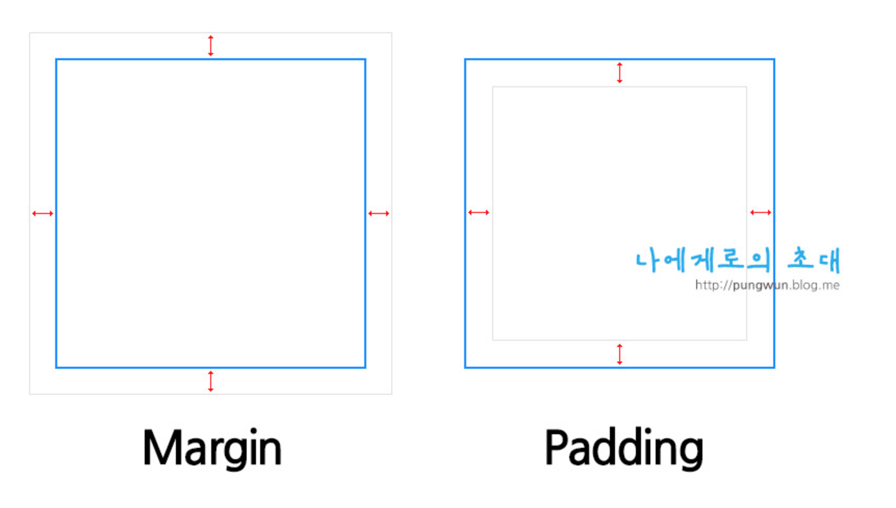

#study css class

1. 박스모델
2. inline요소, block요소
3. float과 clear: both(left, right)
4.position과 z-index


#1.박스모델
## 마진과 패딩의 구별

>마진(margin)은 요소와 요소와의 간격, 즉 바깥 여백을 주는 속성입니다. 주로 px, em, % 등의 단위를 사용합니다.
border 속성과 마찬가지로 방향에 따라 속성을 줄 수 있으며, 줄여서 쓸 수도 있습니다.


```html

div {
  margin-top : 10px;
  margin-left : 30px;
  /* 또는 */
  margin : 10px 0 0 30px;
}
margin은 요소 간의 간격으로 마진끼리는 서로 겹쳐져서 둘 중 큰 간격만큼 벌어집니다. 예를 들어 다음의 소스를 보세요.

<div style="margin-bottom:10px;">Box 1</div>
<div style="margin-top:30px;">Box 2</div>
```





<hr/>