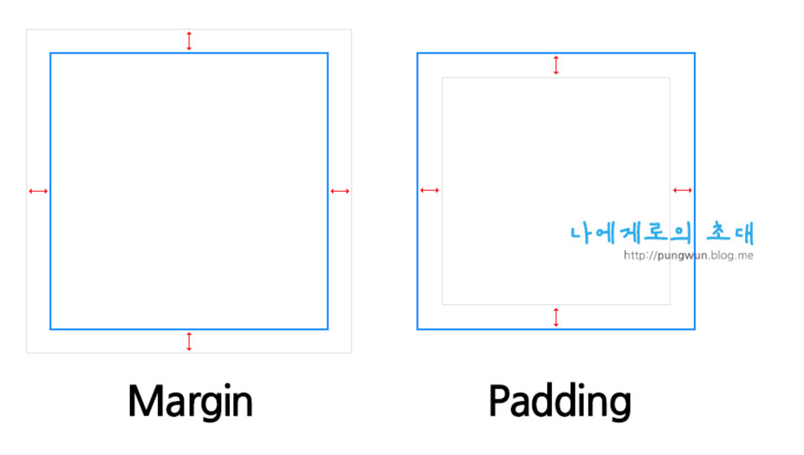

# study css

1. 패딩과 마진의 차이점
2. inline요소, block요소
3. float과 clear: both(left, right)
4. position과 z-index
5. 선택자 - 가상선택자(::after, ::before, ::hover)
6. 미디어쿼리


# 1.패딩과 마진의 차이
## 마진과 패딩의 구별

>마진(margin)은 요소와 요소와의 간격, 즉 바깥 여백을 주는 속성입니다. 주로 px, em, % 등의 단위를 사용합니다.
border 속성과 마찬가지로 방향에 따라 속성을 줄 수 있으며, 줄여서 쓸 수도 있습니다.


```html

div {
  margin-top : 10px;
  margin-left : 30px;
  /* 또는 */
  margin : 10px 0 0 30px;
}

<div style="margin-bottom:10px;">Box 1</div>
<div style="margin-top:30px;">Box 2</div>
```

>패딩(padding)은 요소 내부의 간격, 즉 내부 여백을 주는 속성입니다. 주로 px, em, % 등의 단위를 사용합니다.
border 속성과 마찬가지로 방향에 따라 속성을 줄 수 있으며, 줄여서 쓸 수도 있습니다.

```html
<div style="width:100px;height:100px;padding-top:10px;">Box 1</div>
패딩 탑 10이 더해져 실제로는 내부영역이 110만큼 차지하게 됩니다.
즉 패딩을 쓸경우 width, height의 사용을 주의해서 써야합니다.
```





## 예제 - 실습해보기
[그리드 레이아웃 샘플](https://gridbyexample.com/examples/)


<hr/>


# 2.inline요소, block요소

## 블락요소
>CSS를 통해 스타일을 변경하지 않았다면 블럭 요소(block element)는 화면의 가로폭 전체를 차지하는 직사각형 모양을 가집니다. 모든 인라인 요소는 블럭 요소 안에 속해 있어야하며, body 요소에 바로 담길 수 있습니다.

대표적인 블록 요소는 아래와 같습니다:

* p 요소
* h1 요소
* blockquote 요소
* ul 요소와 ol 요소
* li 요소
* div 요소

>이 중 blockquote 요소와 같은 일부 블럭 요소는 인라인 요소 뿐 아니라 다른 블럭 요소를 포함할 수 있습니다. 반면 p 요소와 같은 블럭 요소는 다른 블럭 요소를 포함할 수 없습니다.

따라서 다음은 올바른 HTML 이지만…

```html
<blockquote>
   <p>...인용문 1...</p>
   <p>...인용문 2...</p>
</blockquote>

다음 HTML은 올바르지 않습니다:

<p><h1>제목</h1></p>
```


## 인라인 요소

>인라인 요소(inline element)는 블럭 요소 혹은 다른 인라인 요소 안에만 쓰일 수 있으며 CSS를 통해 스타일을 변경하지 않았다면 기본적으로 문장이 흐르듯 흐르는 모양을 가집니다.

대표적인 인라인 요소는 아래와 같습니다:

* a 요소
* strong 요소
* em 요소
* span 요소

인라인 요소는 아래와 같이 블럭 요소(p 등) 안에 담겨야 하며, 여러 인라인 요소가 서로 중첩될 수 있습니다:

```html
<p>
    이제 <a href="http://www.google.com">이 링크를 클릭하여 <strong>구글</strong>로 이동</a> 합시다.
</p>
```

위 예시에서 p는 블럭 요소이고, a, strong은 인라인 요소입니다.


## 인라인요소와 블락요소의 스타일 적용의 특징

> 인라인 요소는 크기는 기본적으로 내부 content의 영역만큼 차지합니다. width, height를 강제로 주입해도 바뀌지 않습니다.

```html
<span style="width:100px;height:100px;">영역의 크기가 바뀌지 않습니다.</span>

<span style="margin-top:100px;padding-top:100px;">마진과 패딩이 먹히질 않습니다.</span>

<span style="margin-left:100px;padding-right:100px;">마진과 패딩이 작동합니다.</span>
```

인라인 요소의 특징중에 기억해야 할점은 margin top, bottom padding top, bottom은 작동하질 않지만 margin left, right 그리고 padding left, right는 작동한다는 사실입니다.
